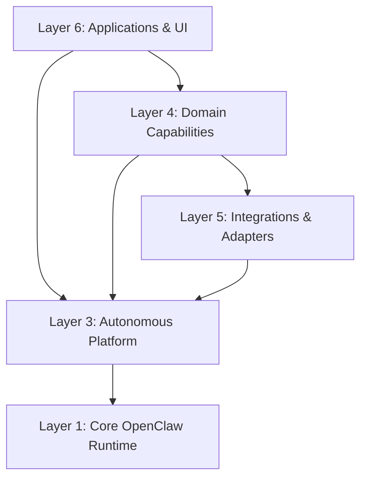

# imClaw Architecture Boundary Audit

**Target Repository**: `/home/elogic360/Projects/imClaw`  
**Date**: October 8, 2026  
**Auditor**: imClaw Core Architecture Team  
**Status**: COMPLETE

---

## Executive Summary

imClaw is an autonomous-agent organizational operating system derived from and running on OpenClaw. This audit investigates the complete source tree, dependency graph, runtime entrypoints, and subsystem responsibilities to establish non-porous boundaries between:

1. **Core OpenClaw Runtime** (gateway, CLI, sessions, channels, plugins, process host)
2. **imClaw Autonomous Platform Infrastructure** (organization engine, multi-agent delegation, multi-tier memory, event bus, approval gates, workflow DAG)
3. **Domain Capabilities** (financial trading, technical market structure analysis)
4. **Product Features & Applications** (visual agents office dashboard, trade journaler, speech direction)
5. **Integrations / Adapters** (brokers, external CRM, messaging bridges)

The audit concludes that while placing autonomous platform logic within `src/imclaw` was an effective initial namespace for decoupling from upstream OpenClaw, treating `src/imclaw` as an undifferentiated catch-all directory creates architectural coupling. Specifically, domain-specific trading execution, market intelligence, trade journaling, and platform-wide capabilities (DAG workflows, memory, approvals) must have explicit layer boundaries.

---

## 1. Repository & OpenClaw Source Structure Audit

### 1.1 Source & Workspace Boundaries

The repository is a monorepo-hybrid managed with **pnpm** and TypeScript project references:

- **Root Entrypoint**: `src/index.ts` / `src/entry.ts` — boots the OpenClaw CLI, daemon, and gateway.
- **Root Packages (`packages/*`)**:
  - `agent-core`: Core agent loop, model driver contracts.
  - `gateway-client` & `gateway-protocol`: Daemon RPC, JSON-RPC, WebSocket wire protocol.
  - `llm-core`, `ai`: Low-level LLM streaming, token counting, prompt templates.
  - `plugin-sdk`, `plugin-package-contract`: Extension API contracts.
  - `memory-host-sdk`: Storage abstraction for agent context.
- **Extensions (`extensions/*`)**: 80+ channel connectors (Telegram, Discord, Slack, WhatsApp), model providers (Anthropic, OpenAI, Gemini, Ollama, DeepSeek), and tools.
- **Frontend / UI (`ui/`)**: Preact/Vite single-page application mounted at `/` by the gateway HTTP server.
- **Gateway HTTP Server (`src/gateway/`)**: Node HTTP/WebSocket server handling WebSocket RPC and static/API route dispatching.
  - Extension point: [`src/gateway/organization-http.ts`](file:///home/elogic360/Projects/imClaw/src/gateway/organization-http.ts) mounts `/api/imclaw/departments` and `/imclaw/office`.

### 1.2 Build System & Verification Commands

- `pnpm tsgo:core`: Typechecks core runtime and `src/`.
- `pnpm test`: Runs Vitest across core test suites.
- `tsx`: Used for runtime script execution and fast-path development.

---

## 2. Comprehensive Audit of `src/imclaw/`

Every module under `src/imclaw/` was inspected across 14 dimensions:

| Module                    | Purpose                                                                                      | Current Layer            | Dependencies                       | Consumers                               | Domain-Specific?  | Recommended Layer               |
| :------------------------ | :------------------------------------------------------------------------------------------- | :----------------------- | :--------------------------------- | :-------------------------------------- | :---------------- | :------------------------------ |
| **`organization/`**       | Company registry, 7 departments, 38 desks, task router, team engine, simulation orchestrator | Platform / Org           | `events/`, `memory/`, `approvals/` | `src/gateway/organization-http.ts`, CLI | No (Generic Org)  | **Platform (Organization)**     |
| **`orchestration/`**      | Agent delegation engine, session fencing, team lifecycle                                     | Platform / Orchestration | `agents/`, `events/`               | `organization/`, CLI                    | No                | **Platform (Orchestration)**    |
| **`memory/`**             | 3-tier memory engine (Working, Episodic, Semantic)                                           | Platform / Memory        | Crypto, stdlib                     | `organization/`, `agents/`              | No                | **Platform (Memory)**           |
| **`events/`**             | In-process pub/sub event bus with typed topics                                               | Platform / Events        | Stdlib                             | All imClaw modules                      | No                | **Platform (Events)**           |
| **`approvals/`**          | Human-in-the-loop & policy approval engine (AUTO, CONFIRM, ADMIN)                            | Platform / Governance    | Stdlib                             | `trading/`, `organization/`             | No                | **Platform (Governance)**       |
| **`workflows/`**          | Deterministic DAG workflow orchestrator with retry & branching                               | Platform / Automation    | Stdlib                             | `trading/`, `organization/`             | No (General DAG)  | **Platform (Workflows)**        |
| **`mcp/`**                | Model Context Protocol platform integration & tool routing                                   | Platform / Tools         | Stdlib                             | `agents/`, `organization/`              | No                | **Platform (MCP)**              |
| **`skills/`**             | Skill registry & execution interfaces                                                        | Platform / Skills        | Stdlib                             | `agents/`, `organization/`              | No                | **Platform (Skills)**           |
| **`security/`**           | ACL bitmasks, finding ledger, runtime self-protection                                        | Platform / Security      | Stdlib                             | Gateway, agents                         | No                | **Platform (Security)**         |
| **`models/`**             | Multi-model routing (fast, reasoning, heavy)                                                 | Platform / LLM           | Stdlib                             | `agents/`                               | No                | **Platform (Model Router)**     |
| **`risk/`**               | Deterministic non-bypassable mathematical trading risk engine                                | Domain / Risk            | Stdlib                             | `trading/`                              | **YES (Trading)** | **Domain (Trading/Risk)**       |
| **`trading/`**            | Broker adapters, simulation broker, execution pipeline                                       | Domain / Execution       | `risk/`, `approvals/`              | `organization/` (Trading Dept)          | **YES (Trading)** | **Domain (Trading/Execution)**  |
| **`journal/`**            | Trade journal, post-trade analysis, PnL reviews                                              | Domain / Product         | `risk/`, `trading/`                | Trading Shihan, Web UI                  | **YES (Trading)** | **Domain (Trading/Journal)**    |
| **`intelligence/sensei`** | Financial personas, prompt templates for market analysis                                     | Domain / Prompts         | Stdlib                             | Trading Shihan                          | **YES (Trading)** | **Domain (Trading/Sensei)**     |
| **`intelligence/guard`**  | Repetition guard & think scrubber (reasoning strip)                                          | Platform / Inference     | Stdlib                             | Agent loop, LLM output                  | No                | **Platform (Inference Guards)** |
| **`intelligence/speech`** | Prosody director & voice tone formatting                                                     | Product / Presentation   | Stdlib                             | Audio generation, TTS                   | No                | **Product (Audio/Voice)**       |

---

## 3. Layer Classification & Separation

We define 6 architectural layers with strict dependency rules:



### Layer 1: Core OpenClaw Runtime (`src/`)

- Gateway server, session state, CLI parser, daemon management, protocol drivers.
- **Rule**: Core OpenClaw MUST NOT import domain logic (Trading, Journal) or application UI.

### Layer 2: imClaw Platform Foundation (`src/imclaw/platform/` or `src/imclaw/core/`)

- Event Bus (`events/`)
- Multi-tier Memory (`memory/`)
- Approval Governance (`approvals/`)
- Security & ACL (`security/`)
- Model Router & Inference Guards (`inference/`)

### Layer 3: imClaw Organizational & Orchestration Engine (`src/imclaw/organization/`)

- Department & Specialist Registry (`company-registry.ts`)
- Task Router & Team Formation (`task-router.ts`, `team-engine.ts`)
- Delegation Engine & Session Fencing (`orchestration/`)
- Deterministic DAG Workflow Engine (`workflows/`)

### Layer 4: Domain Capabilities (`src/imclaw/domains/` or `domains/`)

- **Trading Domain**:
  - `domains/trading/risk`: Deterministic Risk Engine.
  - `domains/trading/execution`: Execution Pipeline & Order Intent.
  - `domains/trading/journal`: Trade Journal & Performance Analytics.
  - `domains/trading/sensei`: Market Structure & Shihan Personas.
- **Future Domains**: Marketing Automations, Legal Review, Support Desk, Healthcare.

### Layer 5: Integrations & Adapters (`src/imclaw/adapters/`)

- Broker Adapters (`simulation`, `ctrader`, `mt5`).
- CRM / Email Adapters (`loops`, `beehiiv`, `hubspot`).

### Layer 6: Applications & UI (`src/gateway/` & `ui/`)

- Gateway HTTP routes (`/api/imclaw/departments`, `/imclaw/office`).
- Visual Agents Office Web Dashboard.

---

## 4. Evaluation of `src/imclaw` as a Boundary

### Should `src/imclaw` remain the primary namespace?

**Answer: YES, with internal layer partitioning.**

**Architectural Rationale**:

1. **Preserving Monorepo Integrity**: Moving imClaw completely outside `src/` (e.g. into root `/imclaw`) disrupts TypeScript project references, path aliasing, and test sharding configured in `tsconfig.core.json` and `tsconfig.json`.
2. **Preventing Upstream Divergence**: OpenClaw upstream treats `src/` as the primary TypeScript compilation root. Keeping imClaw anchored under `src/imclaw/` ensures that `pnpm tsgo:core` and Vitest continue to compile and verify all types in a single pass.
3. **Internal Modularization**: The issue is NOT the parent folder `src/imclaw`; the issue is the lack of internal separation between **Platform Infrastructure** and **Domain Capabilities**. Subdividing `src/imclaw` into `platform/` and `domains/` cleanly isolates domain features without breaking build tooling.

---

## 5. Domain Boundary Classifications

### 5.1 Trading Domain Isolation

Trading is a specific, high-risk domain requiring strict mathematical safeguards.

- **Risk Engine Isolation**: The [`DeterministicRiskEngine`](file:///home/elogic360/Projects/imClaw/src/imclaw/risk/risk-engine.ts) must remain zero-dependency on LLM outputs. It takes pure typed data (`TradeIntent`, `AccountRiskState`) and returns deterministic verdicts.
- **Non-Bypassable Pipeline**:
  ```text
  Autonomous Agent (Shihan)
            ↓ (TradeIntent)
  Deterministic Risk Guard (RiskPolicy Checks)
            ↓ (RiskEvaluationResult: APPROVED)
  Human/Policy Approval Gate (Tiered Check)
            ↓ (CONFIRMED)
  Broker Execution Pipeline
            ↓
  Broker Adapter (Simulation / Live)
  ```
- **Finding**: Risk Engine and Trading Execution belong together in a dedicated `domains/trading/` namespace.

### 5.2 Journal Classification

- The Trade Journaler currently resides in `src/imclaw/journal/`.
- It records `TradeIntent`, `RiskEvaluationResult`, and `ExecutionOrder`.
- **Verdict**: It is **Trading Domain Infrastructure**, not core platform infrastructure. It should consume trade events via the Platform Event Bus (`trade:filled`, `trade:closed`), allowing other parts of imClaw to operate without knowing what a stop-loss or trade journal is.

### 5.3 Workflows Classification

- The Workflow Engine in `src/imclaw/workflows/workflow-engine.ts` executes topological DAG graphs with retries, branch conditions, and step handlers.
- **Verdict**: It is **Core Platform Infrastructure**. It is used by marketing campaigns, onboarding pipelines, multi-department GTM initiatives, and trading signal processing. It belongs in Platform Orchestration.

### 5.4 Intelligence Classification

The modules under `src/imclaw/intelligence/` have differing responsibilities:

- `sensei-registry.ts`: Specific to Financial Trading personas $\rightarrow$ belongs in `domains/trading/`.
- `repetition-guard.ts` & `think-scrubber.ts`: LLM token loop prevention and reasoning scrapers $\rightarrow$ belong in `platform/inference/`.
- `speech-director.ts`: Audio presentation and emotional prosody $\rightarrow$ belongs in `platform/presentation/` or product tools.

---

## 6. Target Directory Architecture

```text
src/imclaw/
├── platform/                      # Reusable Autonomous Platform Infrastructure
│   ├── organization/              # Company registry, departments, desks, task router
│   ├── orchestration/             # Delegation engine, session fencing, team lifecycle
│   ├── workflows/                 # Generic DAG workflow engine
│   ├── memory/                    # Multi-tier memory engine (Working, Episodic, Semantic)
│   ├── events/                    # Event bus with typed pub/sub
│   ├── approvals/                 # Human-in-the-loop governance & approval tiers
│   ├── security/                  # ACL bitmasks, finding ledger, self-protection
│   ├── inference/                 # Think scrubber, repetition guard, model routing
│   ├── mcp/                       # Model Context Protocol platform integration
│   └── skills/                    # Skill catalog & execution interfaces
│
├── domains/                       # Pluggable Business & Domain Implementations
│   └── trading/                   # Financial Autonomous Trading Domain
│       ├── risk/                  # Deterministic mathematical risk engine
│       ├── execution/             # Order pipeline, intent schemas, broker adapters
│       ├── journal/               # Trade journaling & post-session analytics
│       └── intelligence/          # Market structure Shihan & Sensei profiles
│
├── adapters/                      # External Service Adapters
│   └── brokers/                   # Simulation broker, cTrader, MT5
│
└── index.ts                       # Public platform barrel export
```

---

## 7. Migration Plan & Safety Guardrails

1. **Zero Downtime / Zero Regression**:
   - The Gateway HTTP route [`src/gateway/organization-http.ts`](file:///home/elogic360/Projects/imClaw/src/gateway/organization-http.ts) must continue to function without route changes.
   - All 30 unit tests in [`src/imclaw/imclaw-subsystems.test.ts`](file:///home/elogic360/Projects/imClaw/src/imclaw/imclaw-subsystems.test.ts) must remain 100% green.
   - Public barrel export [`src/imclaw/index.ts`](file:///home/elogic360/Projects/imClaw/src/imclaw/index.ts) will provide backwards-compatible re-exports during transition.
2. **Verification Gates**:
   - Step 1: Document architectural boundaries and obtain approval.
   - Step 2: Implement directory structure adjustments cleanly with git tracking.
   - Step 3: Run `pnpm tsgo:core` and test suites.
   - Step 4: Verify live endpoints (`/api/imclaw/departments`, `/imclaw/office`).
